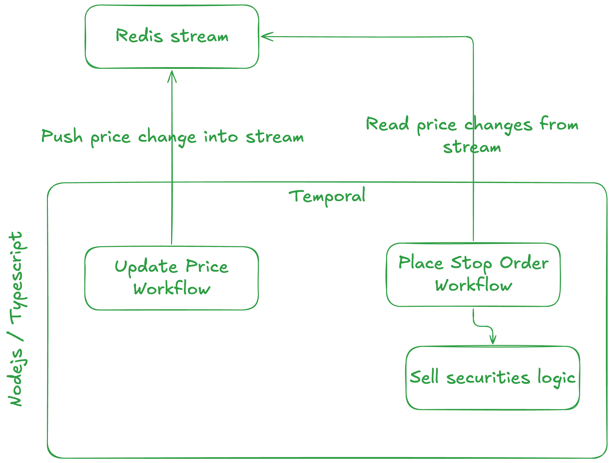

# Stop Loss Order



- Using Temporal to manage durable workflow for managing a stream of security price changes and managing stop loss orders.
- Temporal was picked for a strong learning opportunity.
- A redis stream is used store security price updates.
- Updates to securities are pulled from redis stream rather than using redis pubsub due to challenges with orchestration in Temporal and the need to implement fan out functionality outside of temporal workflow.
- This implementation wouldn't scale to millions of orders, instead it would be implemented with a more scalable queue technology.

# Usage

NOTE: tested using podman.

Start Temporal and Redis:

```
cd docker-compose
docker-compose up
```

Start worker:

```
docker run --rm $(docker build -q .) pnpm start
```

Setup stop loss order:

```
docker run --rm $(docker build -q .) pnpm placeStopOrder TICKER 1000 100
```

- TICKER can be able string
- 1000 is an example price
- 100 is an example quantity

Update price:

```
docker run --rm $(docker build -q .) pnpm placeStopOrder TICKER 1000
```

- TICKER can be able string
- 1000 is an example price
- 100 is an example quantity

The following is logged when an order is placed:

```
**** PLACE SELL ORDER ****
```

# Key file location

- `src/activities.ts` contains the core functionality for the application.
- `updatePriceStream` appends to the stream.
- `placeStopLossOrder` monitors for changes to the price and applies logic to sell when it drop below given point.
